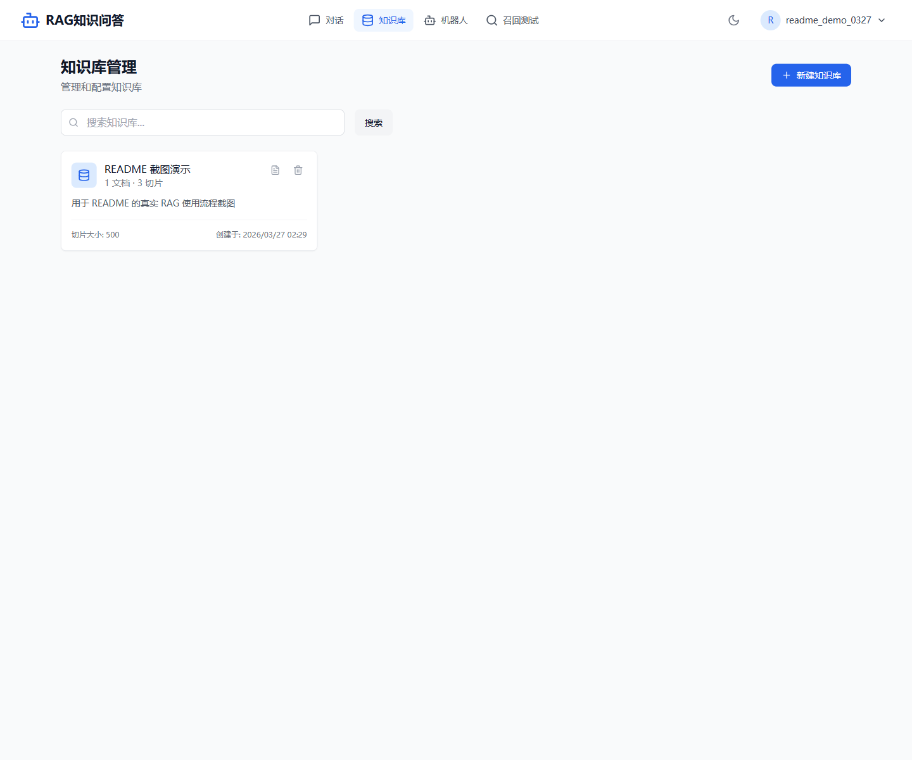
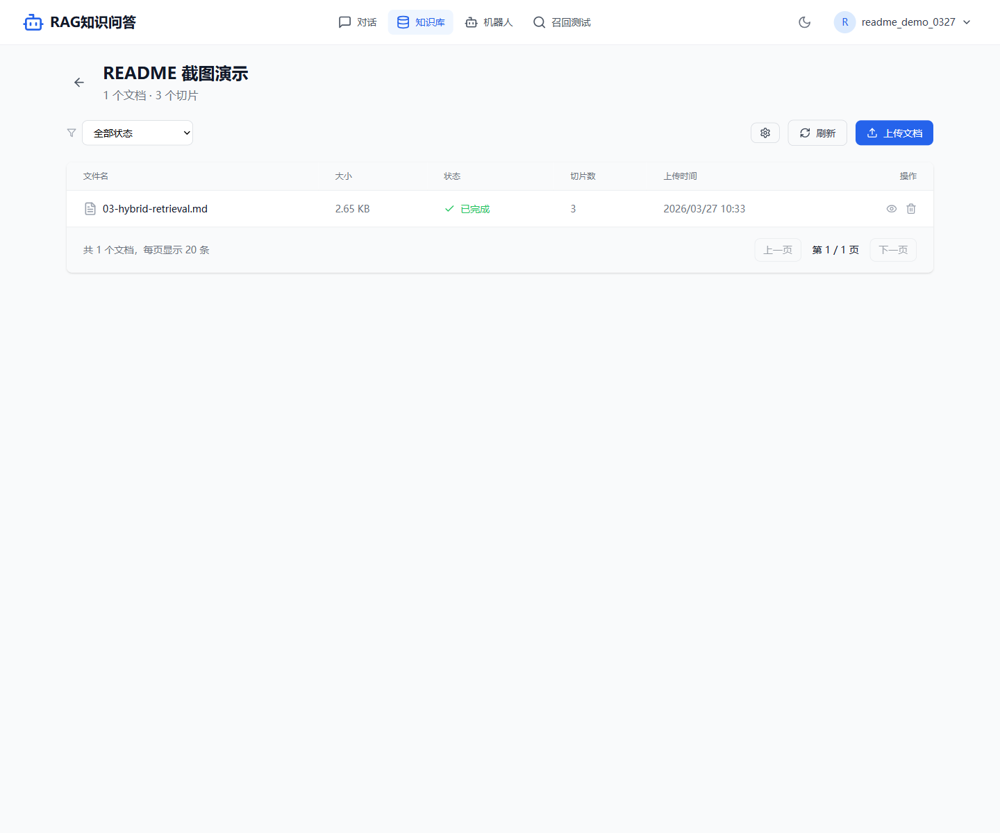
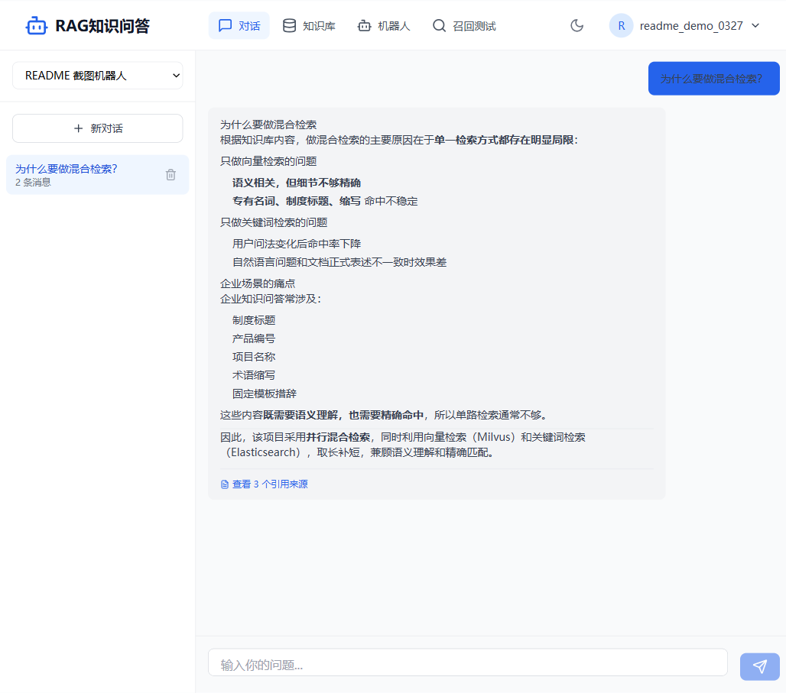

# 企业级 RAG 知识问答系统

[](https://opensource.org/licenses/MIT)
[](https://www.python.org/downloads/)
[](https://nextjs.org/)

这是一个基于检索增强生成（Retrieval-Augmented Generation, RAG）技术的全栈智能知识问答系统。系统支持多格式文档上传、自动化解析、语义切片、向量化存储及混合搜索，旨在为企业提供高效、精准的本地知识问答能力。

---

## 📸 实际运行截图

以下截图来自本地 compose 环境的真实运行结果，并通过 Playwright 采集：

### 1. 知识库总览



### 2. 文档入库完成



### 3. MiniMax 驱动的 RAG 对话



---

## 🚀 项目特性

- **全异步后端**: 基于 FastAPI 实现的高性能异步 API，确保高并发处理能力。
- **现代化前端**: 采用 Next.js 14 (App Router) 构建，响应式设计，极致的用户体验。
- **去 LangChain 化**: 核心逻辑自研实现，降低复杂度，提升系统可控性与性能。
- **混合检索策略**: 结合 Milvus 向量检索与 Elasticsearch 全文检索（IK 分词），大幅提升召回精度。
- **文档全生命周期管理**: 支持 PDF、Word、TXT、Markdown、HTML 等多种格式的自动化处理。
- **微服务 Worker 架构**: 文档解析、切片、向量化与召回评测均通过 Kafka Worker 异步解耦处理。
- **MiniMax 大模型接入**: 已实测支持通过 Anthropic 兼容接口接入 MiniMax 作为聊天模型，完成真实 RAG 问答。
- **Skills Runtime 能力**: 已支持本地 skill 注册表、机器人技能绑定与排序、运行时 prompt 注入，以及聊天页和机器人页的技能展示。
- **Skills 治理强化**: 已支持 install task 持久化、操作审计日志、远端来源白名单、受控远端下载、checksum 校验与可选 Ed25519 签名校验，为后续受控 marketplace 做准备。
- **Skills 管理后台**: 已提供 `/admin/skills` 治理台，用于发起远端安装、查看安装任务、单任务详情、审计日志、版本差异、漂移绑定和回滚准备信息，并可对符合条件的远端安装任务执行 retry / cancel。
- **Skills 安装交接闭环**: 已支持在 `/admin/skills` 的单任务详情中查看关联审计时间线、跳转到 skill 详情和机器人编辑页，并按 “review -> bind -> validate in chat” 完成安装后的交接验证。
- **Skills Provenance 追踪**: 已支持把 install task 来源带入机器人 skill 绑定、审计日志和运行时 `active_skills`，让后台操作、机器人配置和聊天表现能串成同一条来源链路。
- **SiliconFlow 深度集成**: 针对大模型 Embedding 接口提供自动分批、指数退火重试及详细错误诊断。

---

## 🛠️ 技术栈

### 后端 (Backend)
- **框架**: FastAPI
- **异步驱动**: SQLAlchemy (Async), aiomysql, aiokafka, redis-py, elasticsearch-py
- **向量检索**: Milvus 2.4.x
- **全文检索**: Elasticsearch 7.17.x (含 IK 分词器)
- **消息队列**: Apache Kafka 3.6.x
- **Embedding 模型**: 本地部署 Qwen3-Embedding-0.6B
- **日志管理**: Loguru

### 前端 (Frontend)
- **框架**: Next.js 14 (App Router)
- **状态管理**: Zustand
- **样式**: Tailwind CSS
- **HTTP 客户端**: Axios
- **可视化**: Recharts

### 基础设施 (Infrastructure)
- **容器化**: Docker & Docker Compose
- **存储**: MySQL 8.0, Redis 7.2, MinIO

---

## 📂 目录结构

```text
rag/
├── backend/                # 后端服务
│   ├── app/                # 核心逻辑
│   ├── config/             # 模型与业务配置
│   ├── data/               # 本地存储 (原始文件、清洗结果)
│   ├── docker/             # Elasticsearch 镜像与 IK 插件资源
│   ├── models/             # 本地 Embedding 模型权重
│   ├── scripts/            # 跨平台运维与维护脚本
│   ├── sql/                # 数据库初始化脚本
│   ├── tests/              # 单元测试与压力测试
│   ├── docker-compose.yaml # 本地完整编排入口
│   └── main.py             # 入口文件
├── front/                  # 前端应用
│   ├── src/                # 源代码
│   └── cypress/            # E2E 测试
└── README.md                # 项目总文档
```

---

## 🏁 快速开始

### 1. 环境准备
确保已安装以下工具：
- [Docker](https://www.docker.com/) & [Docker Compose](https://docs.docker.com/compose/)
- [Python 3.10+](https://www.python.org/downloads/)
- [Node.js 18+](https://nodejs.org/)

### 2. 推荐的一键本地启动方式

先准备后端环境文件：

```bash
cp backend/.env.example backend/.env
```

然后检查并修改这些关键项：

- `JWT_SECRET_KEY`
- `AES_ENCRYPTION_KEY`
- `EMBEDDING_MODEL_PATH`

推荐直接使用 compose 运维脚本启动整套环境：

```bash
python backend/scripts/rag_stack.py start --build
```

启动成功后可以访问：

- 前端: `http://localhost:33004`
- 后端健康检查: `http://localhost:38084/health`
- Swagger: `http://localhost:38084/docs`
- Skills 列表页: `http://localhost:33004/skills`
- Skills 管理后台: `http://localhost:33004/admin/skills`
- Kafka UI: `http://localhost:8080`
- Attu: `http://localhost:8001`

### 3. 常用运维命令

查看状态：

```bash
python backend/scripts/rag_stack.py status
```

查看日志：

```bash
python backend/scripts/rag_stack.py logs --tail 100
```

定向重启服务：

```bash
python backend/scripts/rag_stack.py restart backend --include-dependents
```

停止整套环境：

```bash
python backend/scripts/rag_stack.py stop
```

从 operator CLI 直接运行共享的浏览器烟测：

```bash
python backend/scripts/rag_stack.py smoke --ensure-admin
```

这个入口会先确保专用 Playwright smoke admin 存在，再包装前端 Playwright 烟测，并把最新产物镜像到 `front/test-results/playwright-smoke/operator/latest/`。

更详细的本地编排与排障说明见：

- [docs/full-stack-compose.md](docs/full-stack-compose.md)
- [docs/compose-troubleshooting.md](docs/compose-troubleshooting.md)
- [docs/local-integration.md](docs/local-integration.md)
- [docs/minimax-anthropic-setup.md](docs/minimax-anthropic-setup.md)
- [docs/demo-data-utf8-repair.md](docs/demo-data-utf8-repair.md)

### 4. 手工开发模式

如果你需要不通过 compose 直接本地跑后端：

```bash
cd backend
python -m venv .venv
# activate backend/.venv in your current shell, then:
python -m pip install -r requirements.txt
python -m alembic -c alembic.ini upgrade head
python -m uvicorn app.main:app --host 0.0.0.0 --port 38084
```

Worker 可分别启动：

```bash
cd backend
python -m app.workers.parser
python -m app.workers.splitter
python -m app.workers.vectorizer
python -m app.workers.recall_worker
```

前端单独开发：

```bash
cd front
npm install
npm run dev
```

---

## 🤖 MiniMax 接入方式

项目当前已经验证通过 MiniMax 的 Anthropic 兼容接口作为聊天模型接入 RAG 主链路。

推荐配置方式：

1. 在管理后台的 `LLM 配置` 中新增一个 `chat` 类型模型。
2. `provider` 填 `anthropic`。
3. `model_name` 填 `MiniMax-M2.5`，或者使用 MiniMax 兼容返回的 Claude 别名模型。
4. `base_url` 填 `https://api.minimaxi.com/anthropic`。
5. 在 `API Keys` 中为该 LLM 绑定 MiniMax 的访问密钥。
6. 在机器人配置中把这个 chat LLM 绑定到目标知识库机器人上。

当前后端会自动把 `https://api.minimaxi.com/anthropic` 归一化到 `/v1/messages`，并按 Anthropic 原生格式包装消息体，因此可以直接使用兼容地址而不需要手动补完整接口路径。

更详细的接入说明、限制和排障见：

- [docs/minimax-anthropic-setup.md](docs/minimax-anthropic-setup.md)
- [docs/demo-data-utf8-repair.md](docs/demo-data-utf8-repair.md)

如果你需要通过脚本修复或重建中文 demo 数据，推荐直接使用仓库里的 UTF-8 安全修复入口：

```bash
python backend/scripts/repair_demo_unicode.py --dry-run
python backend/scripts/repair_demo_unicode.py
```

---

## 🔑 环境变量说明

| 变量名 | 说明 | 默认值 |
| :--- | :--- | :--- |
| `DB_PASSWORD` | MySQL 密码 | `rag_jin` |
| `JWT_SECRET_KEY` | JWT 签发密钥 | 请务必修改 |
| `AES_ENCRYPTION_KEY` | API Key 加密密钥 (32位) | 请务必修改 |
| `ES_HOST` | Elasticsearch 地址 | `http://localhost:9200` |
| `KAFKA_BOOTSTRAP_SERVERS` | Kafka 地址 | `localhost:9094` |
| `NEXT_PUBLIC_API_URL` | 前端调用的后端地址 | `http://localhost:38084` |
| `PLAYWRIGHT_SMOKE_USERNAME` | 专用 Playwright 烟测管理员用户名 | `playwright_smoke_admin` |
| `PLAYWRIGHT_SMOKE_EMAIL` | 专用 Playwright 烟测管理员邮箱 | `playwright-smoke@example.com` |
| `PLAYWRIGHT_SMOKE_PASSWORD` | 专用 Playwright 烟测管理员密码 | 请务必修改 |
| `SKILL_INSTALL_ROOT` | 本地 skills 安装根目录 | `./data/skills` |
| `ENABLE_REMOTE_SKILL_INSTALL` | 是否允许远端 skill 安装 | `False` |
| `SKILL_REMOTE_ALLOWED_HOSTS` | 允许远端 skill 安装的主机白名单，逗号分隔 | 空 |
| `SKILL_REMOTE_REQUIRE_CHECKSUM` | 是否强制远端安装请求携带 checksum | `True` |
| `SKILL_REMOTE_REQUIRE_SIGNATURE` | 是否强制远端安装请求携带签名 | `False` |
| `SKILL_REMOTE_MAX_PACKAGE_MB` | 允许的远端 skill 包最大体积 | `20` |
| `SKILL_REMOTE_DOWNLOAD_TIMEOUT_SECONDS` | 远端 skill 包下载超时时间（秒） | `60` |
| `SKILL_REMOTE_ED25519_PUBLIC_KEY` | 可选的 Ed25519 公钥，用于校验远端 skill 签名 | 空 |

---

## 📖 API 接口文档

后端服务启动后，可通过以下地址查看详细的 Swagger UI 文档：
- **API 文档**: `http://localhost:38084/docs`
- **健康检查**: `http://localhost:38084/health`

---

## 🧪 测试与质量

### 后端
```bash
cd backend
# 运行单元测试
pytest tests/
# 运行压力测试
python tests/stress_test_upload.py
# 代码检查
ruff check .
```

### 前端
```bash
cd front
# 运行 Lint
npm run lint
# 运行类型检查
npm run type-check
# 运行 Playwright 烟测
npm run smoke:playwright
```

`npm run lint` 现在已经有仓库内 ESLint 配置，不会再触发 Next.js 首次运行的交互式初始化；当前剩余 warning 已转入后续前端 lint 基线清理规划。

`npm run type-check` 现在会在首次运行缺少 `.next/types` 时自动完成自举，并关闭这次检查的增量缓存，避免 App Router 生成类型文件尚未就绪时出现偶发失败。

当前前端 `lint` 基线已经清零，`npm run lint`、`npm run type-check` 和 `npm run build` 都可以在仓库内直接稳定通过。

`npm run smoke:playwright` 会对本地栈的登录、聊天、知识库、skills 和 `/admin/skills` 做一次浏览器级烟测，并把 `summary.json` 与步骤截图输出到 `front/test-results/playwright-smoke/<timestamp>/`。

`python backend/scripts/rag_stack.py smoke --ensure-admin` 提供了共享的 operator 包装器，会使用专用的 `PLAYWRIGHT_SMOKE_*` 凭据契约同步本地 smoke admin，并在 `front/test-results/playwright-smoke/operator/` 下维护 `runs/<timestamp>/`、`latest/` 和 `latest-run.json`，便于重复执行和自动化归档。
仓库当前也已经提供了对应的 GitHub Actions 工作流 `.github/workflows/frontend-playwright-smoke.yml`，会在 `pull_request`、`push master` 和手动触发时复用同一条 `rag_stack.py smoke --ensure-admin` 路径，并通过 Buildx 缓存预构建后端、前端和 ES 镜像。
`npm run type-check` 的自举脚本现在也会在需要重建 Next 生成类型时先清理陈旧 `.next` 产物，减少目录清理竞态导致的偶发失败。
`npm run build` 也已经切到仓库内 wrapper，遇到旧 `.next/export` 目录清理竞态时会自动清理并重试一次。

### 本地集成链路

推荐在基础设施或 worker 变更后运行：

```bash
python backend/scripts/local_integration.py --start-infra
```

---

## 🤝 贡献指南

1. Fork 本项目。
2. 创建特性分支 (`git checkout -b feature/AmazingFeature`)。
3. 提交更改 (`git commit -m 'Add some AmazingFeature'`)。
4. 推送到分支 (`git push origin feature/AmazingFeature`)。
5. 提交 Pull Request。

---

## 📄 许可证

本项目基于 [MIT 许可证](LICENSE) 开源。

---

## 📝 更新日志

详见 [backend/CHANGELOG.md](backend/CHANGELOG.md)。


---

## 📚 文档导航

- [docs/README.md](docs/README.md)
- [docs/rag-workflow-hybrid-retrieval.md](docs/rag-workflow-hybrid-retrieval.md)
- [docs/minimax-anthropic-setup.md](docs/minimax-anthropic-setup.md)
- [docs/demo-data-utf8-repair.md](docs/demo-data-utf8-repair.md)
- [docs/skills-audit-report.md](docs/skills-audit-report.md)
- [docs/skills-definition-and-boundary.md](docs/skills-definition-and-boundary.md)
- [docs/skills-architecture.md](docs/skills-architecture.md)
- [docs/skills-remote-install-security.md](docs/skills-remote-install-security.md)
- [docs/skills-governance-hardening.md](docs/skills-governance-hardening.md)
- [docs/skills-versioning-and-rollback.md](docs/skills-versioning-and-rollback.md)
- [docs/skills-remote-allowlist-runbook.md](docs/skills-remote-allowlist-runbook.md)
- [docs/skills-bootstrap-slice.md](docs/skills-bootstrap-slice.md)
- [docs/skills-runtime-integration.md](docs/skills-runtime-integration.md)
- [docs/skills-admin-console.md](docs/skills-admin-console.md)
- [docs/skills-remote-install-execution.md](docs/skills-remote-install-execution.md)
- [docs/skills-remote-install-operator-ui.md](docs/skills-remote-install-operator-ui.md)
- [docs/skills-remote-install-smoke-test.md](docs/skills-remote-install-smoke-test.md)
- [docs/skills-install-handoff.md](docs/skills-install-handoff.md)
- [docs/skills-provenance.md](docs/skills-provenance.md)
- [docs/skills-validation-playbook.md](docs/skills-validation-playbook.md)
- [docs/skills-incident-review.md](docs/skills-incident-review.md)
- [docs/skills-validation-evidence.md](docs/skills-validation-evidence.md)
- [docs/skills-validation-automation.md](docs/skills-validation-automation.md)
- [docs/skills-validation-history.md](docs/skills-validation-history.md)
- [docs/skills-validation-regression.md](docs/skills-validation-regression.md)
- [docs/skills-validation-ops.md](docs/skills-validation-ops.md)
- [docs/ops/skills-validation/README.md](docs/ops/skills-validation/README.md)
- [docs/frontend-typecheck-stability.md](docs/frontend-typecheck-stability.md)
- [docs/frontend-eslint-bootstrap.md](docs/frontend-eslint-bootstrap.md)
- [docs/frontend-lint-baseline.md](docs/frontend-lint-baseline.md)
- [docs/frontend-playwright-smoke.md](docs/frontend-playwright-smoke.md)
- [docs/frontend-playwright-operator.md](docs/frontend-playwright-operator.md)
- [docs/frontend-playwright-credential-provisioning.md](docs/frontend-playwright-credential-provisioning.md)
- [docs/frontend-playwright-github-actions.md](docs/frontend-playwright-github-actions.md)
- [docs/frontend-playwright-ci-hardening.md](docs/frontend-playwright-ci-hardening.md)
- [docs/frontend-playwright-reporting-plan.md](docs/frontend-playwright-reporting-plan.md)

## RAG 教学文档

建议按顺序阅读：

- [docs/teaching/README.md](docs/teaching/README.md)
- [docs/teaching/01-rag-overview.md](docs/teaching/01-rag-overview.md)
- [docs/teaching/02-document-ingestion-workflow.md](docs/teaching/02-document-ingestion-workflow.md)
- [docs/teaching/03-hybrid-retrieval.md](docs/teaching/03-hybrid-retrieval.md)
- [docs/teaching/04-answer-generation.md](docs/teaching/04-answer-generation.md)
- [docs/teaching/05-system-components.md](docs/teaching/05-system-components.md)
- [docs/teaching/06-debug-and-validation.md](docs/teaching/06-debug-and-validation.md)
- [docs/teaching/07-architecture-and-sequence-diagrams.md](docs/teaching/07-architecture-and-sequence-diagrams.md)
- [docs/teaching/08-simplified-data-flow.md](docs/teaching/08-simplified-data-flow.md)

---

## 对外投递与面试材料

- [docs/external-delivery-kit.md](docs/external-delivery-kit.md)
- [docs/rag-workflow-hybrid-retrieval.md](docs/rag-workflow-hybrid-retrieval.md)
- [docs/rag-interview-qa.md](docs/rag-interview-qa.md)
- [docs/candidate-resume-template.md](docs/candidate-resume-template.md)
- [docs/project-pitch-scripts.md](docs/project-pitch-scripts.md)
- [docs/repo-copy-assets.md](docs/repo-copy-assets.md)

## English Delivery Materials

- [docs/english-delivery-kit.md](docs/english-delivery-kit.md)
- [docs/english-project-pitch-scripts.md](docs/english-project-pitch-scripts.md)
- [docs/english-repo-copy-assets.md](docs/english-repo-copy-assets.md)

## Showcase Materials

- [docs/showcase-architecture-workflow.md](docs/showcase-architecture-workflow.md)
- [docs/showcase-demo-walkthrough.md](docs/showcase-demo-walkthrough.md)
- [docs/showcase-capture-checklist.md](docs/showcase-capture-checklist.md)

## Case Study Materials

- [docs/case-study-problem-solution-impact.md](docs/case-study-problem-solution-impact.md)
- [docs/case-study-business-technical-challenges.md](docs/case-study-business-technical-challenges.md)
- [docs/case-study-portfolio-summary.md](docs/case-study-portfolio-summary.md)

## Interview Materials

- [docs/interview-technical-deep-dive-qa.md](docs/interview-technical-deep-dive-qa.md)
- [docs/interview-manager-brief.md](docs/interview-manager-brief.md)
- [docs/interview-cheat-sheet.md](docs/interview-cheat-sheet.md)
