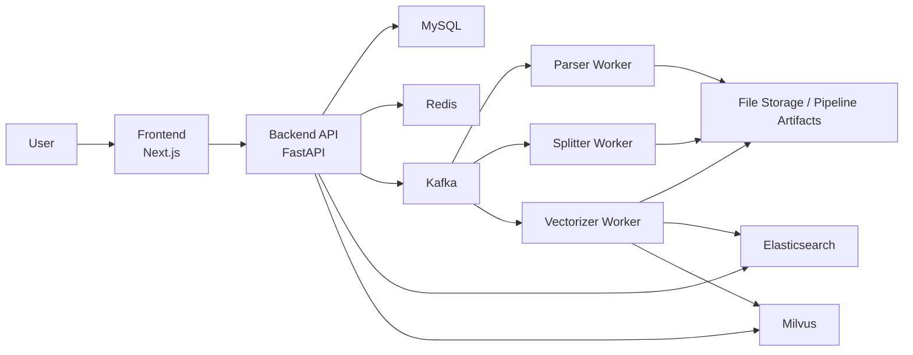
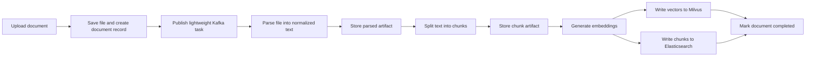
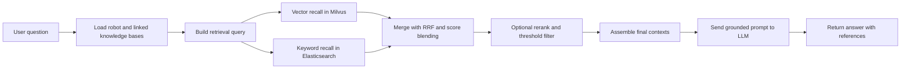

# Showcase Architecture and Workflow

This document is a presentation-ready overview of the project architecture, the RAG workflow, and the hybrid retrieval path. It is intended for interviews, portfolio pages, and repository showcases.

## Project One-Liner

An enterprise-oriented RAG knowledge assistant that turns private documents into searchable knowledge and grounded answers through asynchronous ingestion, hybrid retrieval, and a locally operable full-stack deployment.

## System Overview

## What Each Component Does

- `Frontend (Next.js)`: provides login, knowledge-base management, document upload, robot configuration, and chat UI.
- `Backend (FastAPI)`: exposes APIs, manages permissions, coordinates chat retrieval, and publishes ingestion tasks.
- `MySQL`: stores users, knowledge bases, documents, robots, sessions, and processing status.
- `Redis`: stores active session context and cache-like runtime state.
- `Kafka`: decouples document ingestion stages and isolates failures between workers.
- `Parser Worker`: reads the source file and extracts normalized text.
- `Splitter Worker`: turns parsed text into structured chunks with metadata such as heading and page information.
- `Vectorizer Worker`: generates embeddings, writes vectors to Milvus, writes full chunk records to Elasticsearch, and finalizes document status.
- `Milvus`: stores vectors for semantic recall.
- `Elasticsearch`: stores chunk text and supports keyword and phrase recall.
- `File Storage / Pipeline Artifacts`: stores original uploads and stage-to-stage intermediate artifacts outside Kafka.

## Ingestion Workflow

## Why The Ingestion Design Matters

- Kafka messages now carry only `document_id`, `file_path`, and task metadata, instead of full text or chunk batches.
- Large intermediate content is stored as artifacts between stages, which reduces queue payload size and makes retry and replay safer.
- The pipeline is modeled as explicit states: `uploading -> parsing -> splitting -> embedding -> completed/failed`.
- Reliability is improved with DLQ routing, replay scripts, and stage-level idempotency.

## Online Retrieval Workflow

## Why Hybrid Retrieval Matters

- Vector search captures semantic similarity and helps when the question wording differs from the source text.
- Keyword and phrase search catches exact terminology, policy names, product codes, and internal jargon.
- RRF and score blending combine both signals instead of forcing a single retrieval style.
- This is especially important in enterprise knowledge bases where exact wording often matters as much as semantic similarity.

## Business Value

- Turns internal documents into a searchable and answerable knowledge layer.
- Makes private deployment practical for teams that cannot rely on public SaaS-only AI solutions.
- Improves answer quality by grounding generation on retrieved evidence.
- Reduces operational friction with standard startup, health, logs, restart, and integration-check workflows.

## Showcase Talking Points

- Full RAG chain from upload to answer generation.
- Reliability-focused ingestion design with Kafka, DLQ, replay, and idempotency.
- Hybrid retrieval on Milvus plus Elasticsearch instead of vector-only search.
- Local full-stack orchestration with reproducible operations and validation scripts.
- Engineering maturity beyond a prototype or LLM demo.
