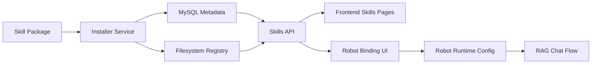

# Skills 技术方案

## 目标

这份文档把 `skills` 的第一版实现范围压缩为一个可落地的最小闭环：

- 有本地存储
- 有后端元数据 API
- 有前端列表与详情页
- 有机器人绑定关系
- 有显式安装与卸载动作
- 远端安装默认关闭

## 一阶段架构



## 数据模型建议

推荐新增三张表。

### `rag_skill`

表示一个 skill 的稳定身份。

建议字段：

- `id`
- `slug`
- `name`
- `description`
- `category`
- `source_type`
  - `local`
  - `remote`
- `status`
  - `active`
  - `disabled`
  - `archived`
- `created_by`
- `created_at`
- `updated_at`

### `rag_skill_version`

表示 skill 的具体版本和包信息。

建议字段：

- `id`
- `skill_id`
- `version`
- `manifest_json`
- `install_path`
- `package_url`
- `checksum`
- `is_current`
- `install_status`
  - `pending`
  - `installing`
  - `installed`
  - `failed`
- `error_msg`
- `created_at`

### `rag_robot_skill_binding`

表示机器人与 skill 的多对多绑定关系。

建议字段：

- `id`
- `robot_id`
- `skill_id`
- `binding_config_json`
- `priority`
- `status`
- `created_at`

## 文件系统布局

推荐本地目录：

```text
backend/data/skills/
├── registry/
│   └── installed.json
├── packages/
│   └── uploads/
├── extracted/
│   └── <skill-slug>/<version>/
└── quarantine/
    └── <task-id>/
```

目录职责：

- `registry/`
  - 用于本地缓存和调试查看
- `packages/uploads/`
  - 存放原始压缩包
- `extracted/`
  - 安装成功后的正式目录
- `quarantine/`
  - 下载后但未通过校验的临时目录

## Manifest 建议格式

`skill.yaml` 建议最小字段：

```yaml
schema_version: 1
slug: contract-review
name: 合同审阅助手
version: 0.1.0
category: legal
description: 用于合同条款理解、风险提示和引用式回答
entrypoints:
  system_prompt: prompts/system.md
  retrieval_prompt: prompts/retrieval.md
  answer_prompt: prompts/answer.md
constraints:
  min_app_version: 1.0.0
  allowed_robot_modes:
    - rag_chat
```

## 后端 API 设计

### 读取类

- `GET /api/v1/skills`
  - 获取技能列表
- `GET /api/v1/skills/{skill_id}`
  - 获取技能详情
- `GET /api/v1/skills/{skill_id}/versions`
  - 获取版本列表
- `GET /api/v1/robots/{robot_id}/skills`
  - 获取机器人已绑定技能

### 管理类

- `POST /api/v1/skills/install-local`
  - 上传本地 skill 包并安装
- `POST /api/v1/skills/install-remote`
  - 通过远端来源安装，默认关闭
- `POST /api/v1/skills/{skill_id}/enable`
- `POST /api/v1/skills/{skill_id}/disable`
- `DELETE /api/v1/skills/{skill_id}`
  - 逻辑删除或归档

### 绑定类

- `POST /api/v1/robots/{robot_id}/skills/{skill_id}`
  - 绑定 skill
- `DELETE /api/v1/robots/{robot_id}/skills/{skill_id}`
  - 解绑 skill
- `PUT /api/v1/robots/{robot_id}/skills/{skill_id}`
  - 更新优先级和绑定配置

## 服务分层建议

### `skill_registry_service`

负责：

- 读取技能元数据
- 解析 manifest
- 返回安装状态

### `skill_installer_service`

负责：

- 安装本地包
- 校验包结构
- 解压到 quarantine
- 通过校验后迁移到 extracted
- 写入数据库和 registry

### `skill_binding_service`

负责：

- 机器人与技能关系维护
- skill 优先级排序
- 运行时技能集合生成

## 运行时接入方式

Skill 不应该改变 RAG 主链路的拓扑，只应该在 prompt 层和参数层插入。

推荐顺序：

1. 加载 robot 基础配置
2. 加载 robot 绑定的 active skills
3. 合并 `system_prompt`
4. 叠加 retrieval 配置建议
5. 保持原有 `knowledge -> retrieve -> rerank -> answer` 主链路不变

这样做的好处是：

- skill 不会侵入底层向量和索引存储
- 可以在不重构 RAG 主流程的情况下增量上线
- 问题更容易回滚和排查

## 前端页面设计

### `/skills`

列表页，展示：

- 名称
- 分类
- 当前版本
- 来源
- 状态
- 已绑定机器人数量
- 安装时间

### `/skills/[id]`

详情页，展示：

- 基础元数据
- 版本历史
- manifest 摘要
- 入口文件
- 绑定机器人
- 启停状态

### 机器人编辑页内嵌 Skill 绑定区

在机器人编辑页增加：

- 已绑定 skill 列表
- 选择 skill 的弹窗
- 优先级调整
- 局部配置覆盖

## 一阶段不做的能力

- 不做 skill market
- 不做自动更新
- 不做 skill 间依赖解析
- 不做在线热更新无感切换
- 不做代码执行型插件

## 推荐落地顺序

1. 先做本地注册表和读取 API
2. 再做本地上传安装
3. 再做机器人绑定
4. 最后才做远端安装

## 下一步

真正开始实现时，请按：

- [skills-bootstrap-slice.md](./skills-bootstrap-slice.md)

如果涉及远端下载与供应链控制，请先看：

- [skills-remote-install-security.md](./skills-remote-install-security.md)
