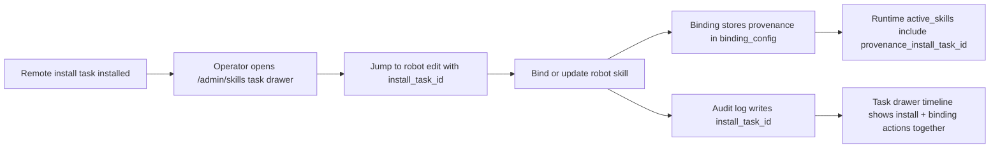

# Skills Provenance

## What Completed In This Slice

This slice carries install provenance into later robot binding and runtime behavior so operators can explain where a visible skill behavior came from.

Completed outcomes:
- Skill binding APIs now accept an optional `install_task_id` when operators bind or update a robot skill after a controlled install.
- Provenance-aware bindings validate that the referenced install task exists, completed successfully, and matches the same skill slug.
- Binding records now retain install provenance inside binding configuration and expose it through `SkillRobotBindingDetail`.
- Binding and update audit logs now inherit the same `install_task_id`, so later robot actions can appear in the install task timeline.
- Active runtime skills now return provenance metadata to the frontend, and the chat / robot skill badges can surface that source.
- Admin task handoff links now preserve provenance when operators jump from an install task into robot editing or perform drift rebinds from the governance console.

## Provenance Flow

## Why This Matters

Before this slice, a completed install could be reviewed, but later binding changes had no explicit source trail.

After this slice:
- operators can connect a robot binding back to the install event that introduced it
- chat/runtime UI can reveal which install task a skill came from
- the task timeline is no longer limited to download/install-only events

## Validation

This slice was validated with:
- `backend/tests/test_skill_service.py`
- `backend/tests/test_skill_runtime_integration.py`
- `front` type checking via `npm run type-check`

## Related Docs

- [skills-runtime-integration.md](./skills-runtime-integration.md)
- [skills-admin-console.md](./skills-admin-console.md)
- [skills-install-handoff.md](./skills-install-handoff.md)
