# Skills Remote Install Security

## Current Project Decision

当前仓库的决策是：
- `ENABLE_REMOTE_SKILL_INSTALL=false`
- 远端 skill 安装继续保持关闭
- 只有本地 zip 包安装属于当前支持范围

这个决策在 runtime integration 阶段已经确认，短期内不会改成默认开启。

## Why It Stays Disabled

原因很直接：
- 远端下载会把供应链风险引入本地 RAG 系统
- 当前项目的目标是稳定的知识问答，不是通用插件市场
- 现阶段的 skill 仍然是 prompt 级能力，不应该在生产链路里临时拉取外部包

## Minimum Safety Bar For A Future Controlled Phase

如果后续真的进入远端安装阶段，至少需要这些控制面：
- 来源白名单
- 强制 checksum 或签名校验
- 包大小与类型限制
- 隔离目录解压
- 审计日志
- 回滚与版本固定

## Recommended Future Workflow

未来如果要做受控远端安装，推荐流程是：

```mermaid
flowchart LR
    A["Admin requests remote install"] --> B["Validate allowlist host"]
    B --> C["Download to quarantine"]
    C --> D["Verify checksum and size"]
    D --> E["Extract to quarantine"]
    E --> F["Validate manifest and prompt files"]
    F --> G["Move into extracted registry"]
    G --> H["Persist install task and audit logs"]
    H --> I["Require explicit robot binding"]
```

## Related Docs

- [skills-definition-and-boundary.md](./skills-definition-and-boundary.md)
- [skills-architecture.md](./skills-architecture.md)
- [skills-bootstrap-slice.md](./skills-bootstrap-slice.md)
- [skills-runtime-integration.md](./skills-runtime-integration.md)
- [skills-marketplace-hardening-plan.md](./skills-marketplace-hardening-plan.md)
