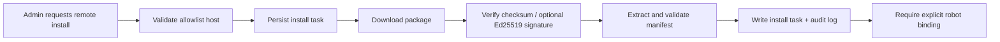

# Skills Remote Install Security

## Current Project Decision

当前仓库的默认策略是：

- `ENABLE_REMOTE_SKILL_INSTALL=false`
- 远端 skill 安装保持关闭
- 当前仅支持本地 zip 包安装进入 skills registry

这个边界在当前阶段是刻意保留的。项目的目标仍然是稳定的企业 RAG 问答系统，而不是开放式插件市场。

## Why Remote Install Stays Disabled By Default

主要原因有三类：

1. 远端下载会把供应链风险引入本地部署环境。
2. 当前 skill 仍然是 prompt / binding 级能力，不应该在生产链路里临时拉取未知包。
3. 远端安装一旦开放，就必须同时具备审计、回滚、版本治理和来源控制，否则风险大于收益。

## Safety Bar Already Added

虽然远端安装还没有真正开放，但仓库已经先补好了第一层治理要求：

- 远端请求可以配置主机白名单：`SKILL_REMOTE_ALLOWED_HOSTS`
- 可强制要求 checksum：`SKILL_REMOTE_REQUIRE_CHECKSUM`
- 可强制要求签名：`SKILL_REMOTE_REQUIRE_SIGNATURE`
- 可限制包体积：`SKILL_REMOTE_MAX_PACKAGE_MB`
- 本地和远端安装尝试都会持久化 install task
- skill 安装、绑定、解绑、更新都会写 audit log
- 管理员可通过只读 API 查询 install tasks 和 audit logs

当前远端安装行为是：

- 功能关闭时：请求会被拒绝，但仍会落 install task 和 audit log
- 功能开启时：请求会执行 allowlist 校验、下载、checksum 校验、可选 Ed25519 签名校验，再进入解压安装
- 管理员可以在 `/admin/skills` 查看单个 install task 的详情，并对允许的远端任务执行 retry / cancel

这意味着治理链路和受控执行链路都已经存在，但仍然需要通过 feature flag 和 allowlist 显式开启。

## Recommended Controlled Workflow

## Operator Guidance

如果未来要在受控环境里试点远端安装，建议顺序保持为：

1. 明确环境是否允许远端安装。
2. 仅配置受控主机到 allowlist。
3. 保持 checksum 校验开启。
4. 如果签名体系已经准备好，配置 `SKILL_REMOTE_ED25519_PUBLIC_KEY`，再开启 signature 要求。
5. 安装后先看 install tasks 里的 verification 字段和 audit logs，再决定是否绑定到机器人。

## Related Docs

- [skills-governance-hardening.md](./skills-governance-hardening.md)
- [skills-versioning-and-rollback.md](./skills-versioning-and-rollback.md)
- [skills-remote-allowlist-runbook.md](./skills-remote-allowlist-runbook.md)
- [skills-admin-console.md](./skills-admin-console.md)
- [skills-remote-install-execution.md](./skills-remote-install-execution.md)
