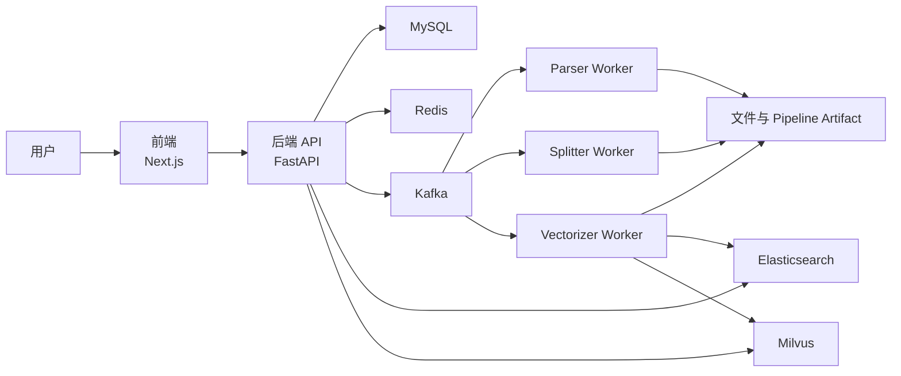
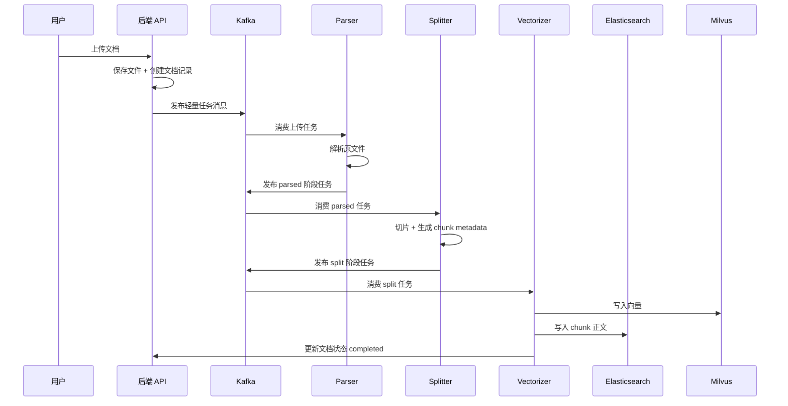
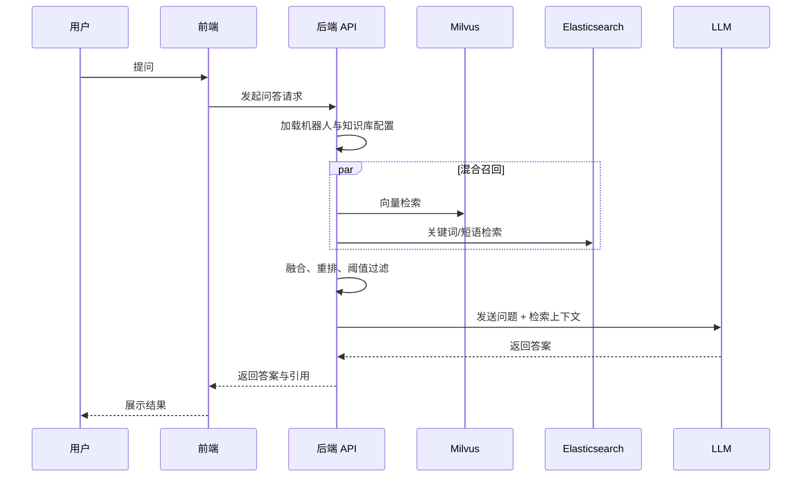

# 07 架构图与时序图

这一章专门用图的方式，把整个 RAG 系统怎么协作讲清楚。适合 onboarding、分享、面试白板讲解和做项目汇报时快速说明系统结构。

## 1. 系统总架构图

## 这张图要怎么讲

可以按三层来讲：

- 产品层：前端和后端，负责用户操作、业务编排和问答入口。
- 数据与检索层：MySQL、Redis、Elasticsearch、Milvus，负责状态、上下文、全文和向量数据。
- 异步处理层：Kafka 和三个 worker，负责把文档加工成可检索知识。

## 2. 文档入库时序图

## 这张图的重点

- 上传不是同步做完所有事，而是异步流水线。
- Kafka 在这里负责解耦，不负责传大文本。
- 每个 worker 只做自己那一段职责。
- 最终是 ES 和 Milvus 一起构成检索底座。

## 3. 在线问答时序图

## 这张图要怎么讲

- 先讲“召回不是单路，是并行两路”。
- 再讲“生成不是直接回答，而是基于检索上下文回答”。
- 最后强调“答案质量依赖检索质量，不只是依赖模型本身”。

## 4. 为什么图解比文字更重要

因为 RAG 项目很容易被误解成：

- 一个聊天框
- 一个向量库
- 一个模型调用

但实际上这里是完整工程系统。图解能快速说明：

- 数据在哪里流动
- 哪些组件在协作
- 哪个阶段出了问题应该查哪一层

## 5. 这一章的使用方式

这份文档最适合拿来做：

- 项目汇报的结构图
- 面试白板讲解的底稿
- 内部 onboarding 的快速说明
- 仓库文档里的视觉补充材料
