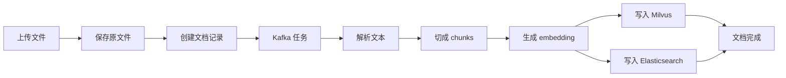
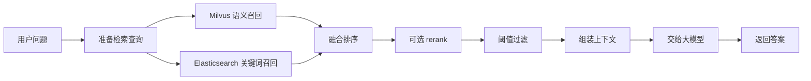

# 08 简化数据流图解

这一章把“文档怎么变成知识、问题怎么变成答案”用最简单的两张数据流图讲清楚。它比完整架构图更适合初学者和第一次接触这个项目的人。

## 1. 从文档到知识

## 怎么理解这张图

这条数据流的目标是把“一个原始文件”变成“两类可检索数据”：

- 向量数据，给 Milvus 用
- 正文与结构数据，给 Elasticsearch 用

也就是说，RAG 的入库不是只为了存文件，而是为了把文件加工成后续检索能用的知识单元。

## 2. 从问题到答案

## 怎么理解这张图

这条数据流的目标不是“直接让模型答”，而是：

1. 先从知识库里找相关片段
2. 再把这些片段变成可用上下文
3. 最后让大模型基于上下文回答

所以生成阶段是最后一步，不是第一步。

## 3. 为什么要拆成两张图

因为 RAG 最容易混淆的是：

- 离线加工知识
- 在线检索并回答

这其实是两条不同的数据流：

- 一条负责“把文档变成知识”
- 一条负责“把问题变成答案”

## 4. 初学者最应该记住的点

- 文档处理链路和问答链路不是一回事
- Kafka 负责任务解耦，不负责存大文本
- ES 和 Milvus 是互补关系，不是二选一
- 大模型是在“有上下文”的前提下生成答案

## 5. 这一章适合什么时候看

如果你刚看完前面的教学内容，想快速把整个项目复述给别人，这一章是最适合拿来做“1 分钟说明图”的。
